<div align="center">

# Exhalo-Scan

### Multi-Omic Respiratory Disease Classification via Volatomics

[](https://nextflow.io)
[](https://python.org)
[](https://opensource.org/licenses/MIT)
[](https://xgboost.readthedocs.io)
[](https://www.ebi.ac.uk/metabolights/MTBLS70)
[](https://www.iisertirupati.ac.in)

**Can exhaled breath tell us which respiratory disease you have?**  
Exhalo-Scan answers this using volatile organic compound (VOC) metabolomics, machine learning, and systems biology — all in one reproducible pipeline.

*Author: **Niraj** · IISER Tirupati · OMICS + Deep Learning Course Project 2025*

</div>

---

## What is Exhalo-Scan?

Exhalo-Scan is a fully modular, end-to-end bioinformatics pipeline that classifies **Asthma**, **COPD**, and **Bronchiectasis** from exhaled breath **VOC profiles** — without any invasive procedures.

It combines:
-  **Robust preprocessing** — PQN normalisation, KNN imputation, ComBat batch correction
-  **Biomarker discovery** — Random Forest + SHAP + Boruta + LASSO stability selection
-  **Machine learning classification** — XGBoost with nested cross-validation
-  **Pathway & network analysis** — KEGG/HMDB enrichment + metabolite co-membership networks
-  **Multi-omics integration** — VOC → pathway → gene expression overlay
  


---

## Key Results

###  Classification Performance

| ROC-AUC Curves | Confusion Matrix |
|:-:|:-:|
| 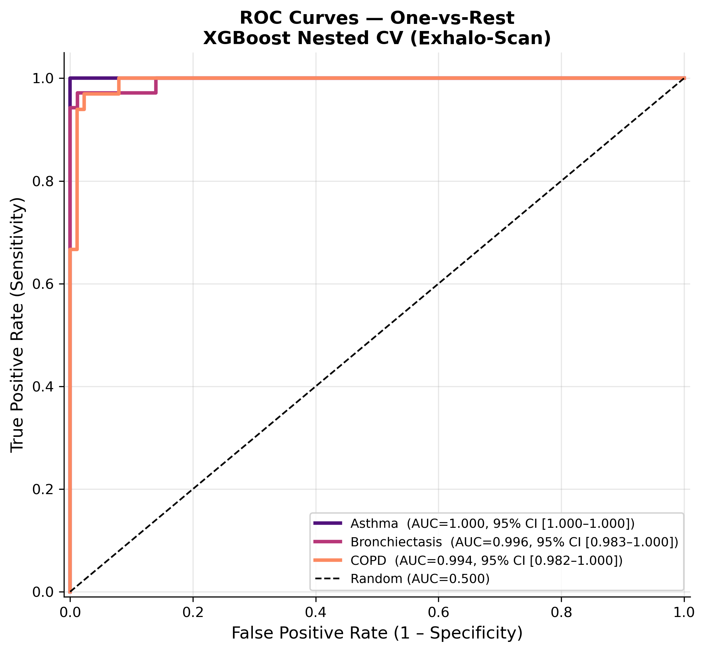 | 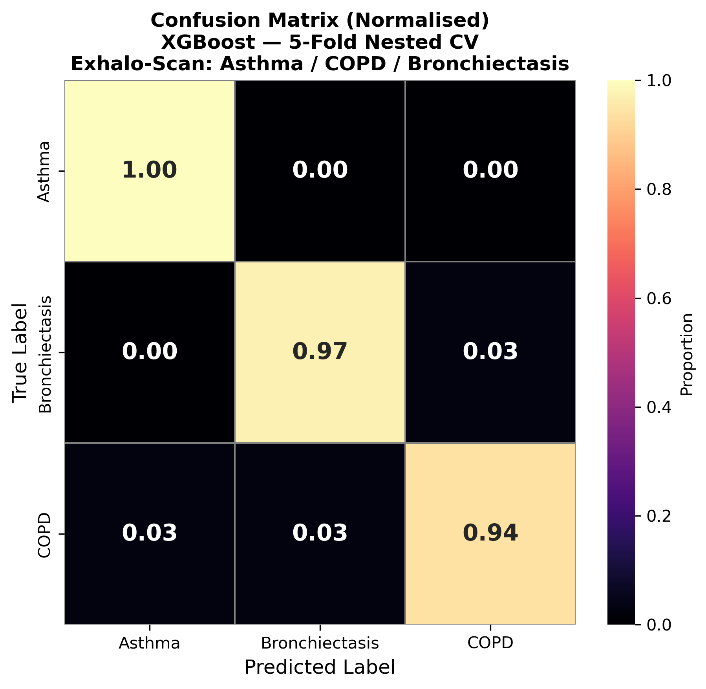 |
| *One-vs-rest classification per disease class* | *Nested cross-validation predictions* |

| Precision-Recall Curves | Top Biomarker Heatmap |
|:-:|:-:|
| 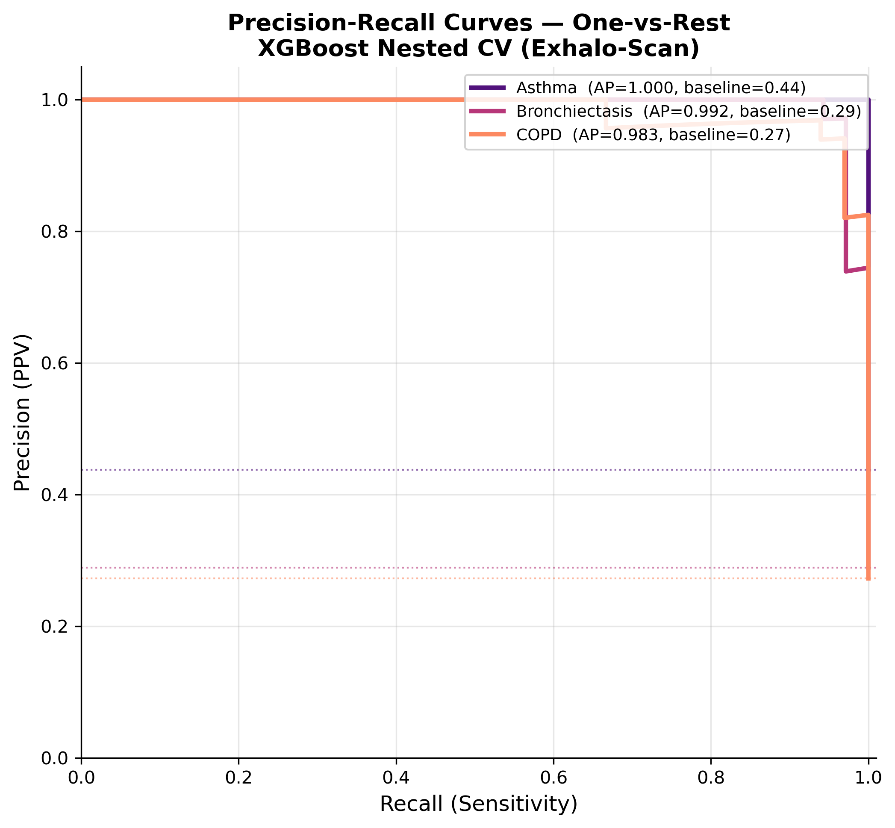 | 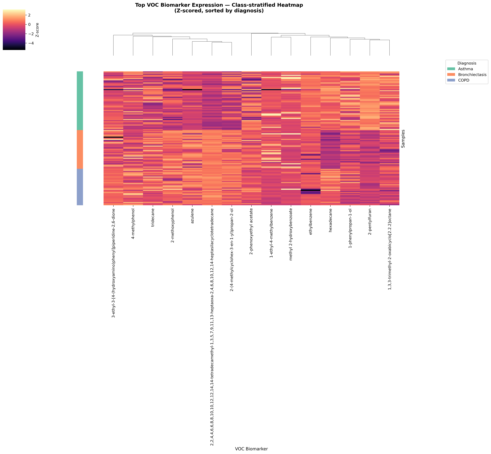 |
| *Performance under class imbalance* | *VOC expression across disease classes* |

---

###  Biomarker Discovery

| SHAP Summary Plot | Random Forest Feature Importance |
|:-:|:-:|
| 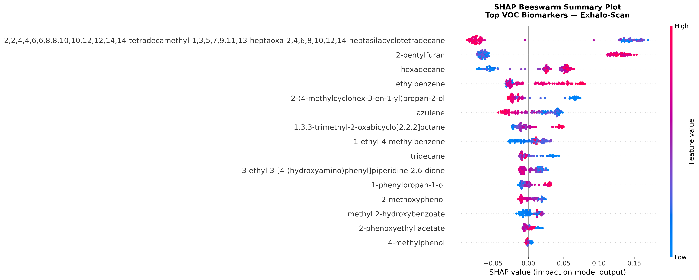 | 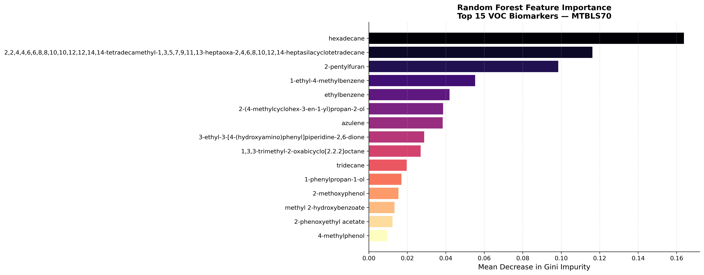 |
| *Feature impact & direction on model output* | *Top VOC biomarkers ranked by importance* |

---

###  Pathway & Network Analysis

| Pathway Enrichment Dot Plot | VOC–Pathway Co-membership Network |
|:-:|:-:|
| 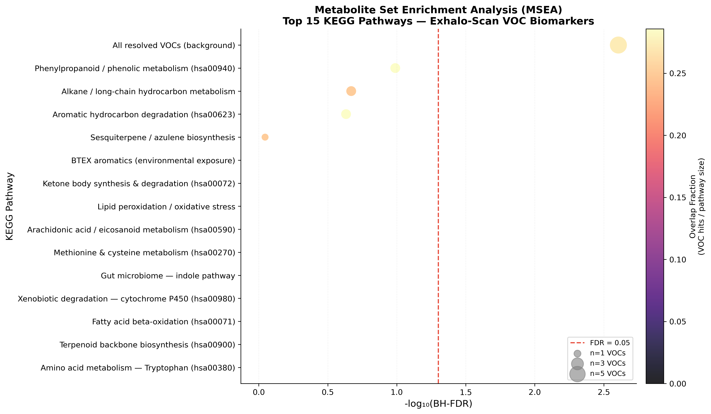 | 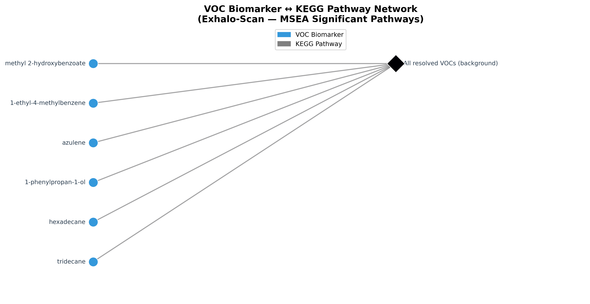 |
| *KEGG/HMDB pathway enrichment (MSEA)* | *Metabolite co-occurrence across pathways* |

---

###  Preprocessing & QC

| PCA Before & After Normalisation | VOC Intensity Distribution |
|:-:|:-:|
| 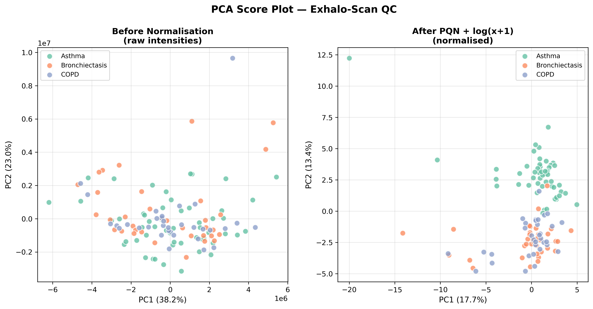 | 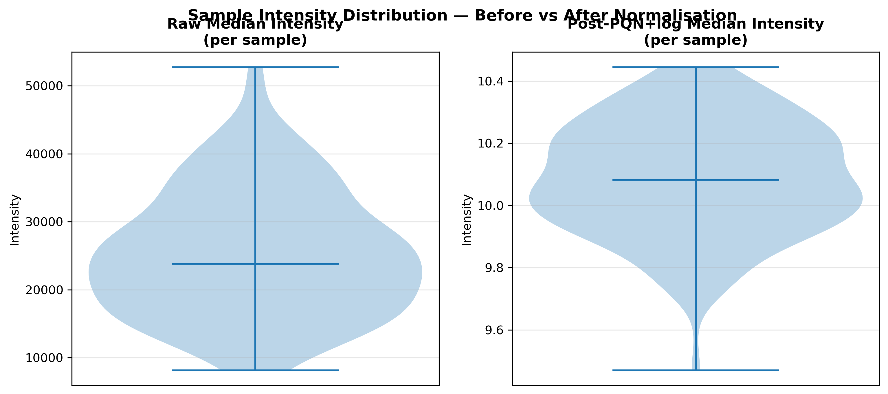 |
| *Batch correction effect on sample clustering* | *Raw vs. normalised signal distributions* |

<div align="center">

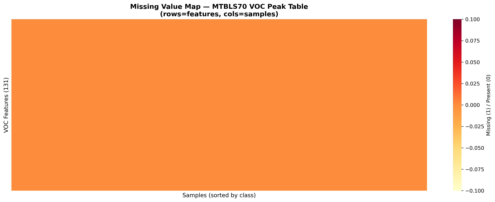  
*Missing Value Heatmap — missingness pattern across samples and features*

</div>

---

##  Pipeline Architecture

```
Raw VOC Peak Table (CSV)
        │
        ▼
 ┌─────────────────────────────────────────────┐
 │  1. PREPROCESS                               │
 │     PQN normalisation → KNN imputation       │
 │     → log-scaling → QC plots                 │
 └───────────────────┬─────────────────────────┘
                     │
                     ▼
 ┌─────────────────────────────────────────────┐
 │  2. BATCH CORRECTION                         │
 │     ComBat (if batch column present)         │
 │     or LOESS smoothing                       │
 └──────┬──────────────────────────────────────┘
        │
        ├──────────────────────┐
        ▼                      ▼
 ┌──────────────┐    ┌───────────────────────┐
 │  3. BIOMARKER │    │  4. FEATURE SELECTION  │
 │   DISCOVERY   │    │  LASSO + Boruta +      │
 │  RF + SHAP    │    │  Stability Selection   │
 └──────────────┘    └───────────┬───────────┘
                                 │
                                 ▼
                     ┌───────────────────────┐
                     │  5. CLASSIFICATION     │
                     │  XGBoost — Nested CV   │
                     │  LR + SVM + Calibration│
                     └───────────┬───────────┘
                                 │
                     ┌───────────┴───────────┐
                     ▼                       ▼
          ┌──────────────────┐   ┌───────────────────┐
          │ 6. EXT VALIDATION │   │  7. ROBUSTNESS     │
          │ (optional)        │   │  Ablation + Noise  │
          └──────────────────┘   └───────────────────┘
                     │
        ┌────────────┴────────────┐
        ▼                         ▼
 ┌─────────────┐        ┌─────────────────────┐
 │ 8. ENRICHMENT│        │  9. ANNOTATION       │
 │ Fisher MSEA  │        │  PubChem+HMDB+KEGG   │
 └─────────────┘        └──────────┬──────────┘
                                   │
                         ┌─────────▼──────────┐
                         │ 10. PATHWAY ANALYSIS│
                         │ Fisher + networkx   │
                         └─────────┬──────────┘
                                   │
                         ┌─────────▼──────────┐
                         │ 11. MULTI-OMICS     │
                         │ VOC → Pathway → Gene│
                         └─────────┬──────────┘
                                   │
                         ┌─────────▼──────────┐
                         │ 12. REPORT GEN v2   │
                         │ Self-contained HTML │
                         └────────────────────┘
```

---

##  Quick Start

### Prerequisites

| Tool | Version |
|------|---------|
| Python | ≥ 3.11 |
| Nextflow | ≥ 23.04 (JVM 11+) |
| Conda env | `workshop_nf` |

### Installation

```bash
# Clone the repository
git clone https://github.com/nsdeshmukh306-ai/exhalo-scan-omics.git
cd exhalo-scan-omics

# Activate conda environment
conda activate workshop_nf

# Install Python dependencies
pip install -r requirements.txt
```

### Install Nextflow (if not already installed)

```bash
curl -s https://get.nextflow.io | bash
mv nextflow ~/.local/bin/
```

---

##  Running the Pipeline

### Basic run

```bash
./run_pipeline.sh -d data/MTBLS70_VOC_peak_table.csv
```

### With external validation dataset

```bash
./run_pipeline.sh \
    -d data/MTBLS70_VOC_peak_table.csv \
    -e data/external_voc_table.csv \
    -m data/external_metadata.csv
```

### Full multi-omics run (with gene expression)

```bash
./run_pipeline.sh \
    -d data/MTBLS70_VOC_peak_table.csv \
    -e data/external_voc_table.csv \
    -m data/external_metadata.csv \
    -g data/gene_expression.csv
```

### Other useful flags

| Flag | Description |
|------|-------------|
| `--test` | Fast test run (~5–10 min) |
| `--no_api` | Offline mode (no REST API calls) |
| `--resume` | Resume interrupted pipeline run |

---

##  Input File Formats

### VOC Peak Table (`--raw_data`)

```csv
SampleID,VOC_1,VOC_2,...,VOC_N
AST_001,12.4,0.0,...,8.7
COP_001,9.1,2.3,...,6.2
BRO_001,5.5,1.1,...,4.0
```

### Metadata CSV (placed in same directory as raw data)

```csv
SampleID,Diagnosis,Batch
AST_001,Asthma,1
COP_001,COPD,1
BRO_001,Bronchiectasis,2
```

> **Tip:** The `Batch` column is optional — if present, ComBat batch correction is automatically applied.

### Gene Expression (optional, for multi-omics)

```csv
Gene,log2FC,adj_pvalue
HMGCR,1.23,0.002
IDO1,2.45,0.0001
```

---

##  Output Structure

```
results/
├──  preprocessing/
│   ├── processed_data.csv
│   ├── metadata.csv
│   └── qc_plots/
│       ├── missing_value_heatmap.png
│       ├── pca_before_after.png
│       └── intensity_distribution.png
│
├──  batch_correction/
│   ├── batch_corrected.csv
│   ├── pca_batch_before.png
│   └── pca_batch_after.png
│
├──  feature_selection/
│   ├── stable_features.csv
│   ├── feature_stability_plot.png
│   └── lasso_coef_plot.png
│
├──  biomarkers/
│   ├── top_biomarkers.csv
│   ├── shap_summary_plot.png
│   ├── rf_feature_importance.png
│   └── biomarker_heatmap.png
│
├──  classification/
│   ├── nested_cv_results.csv
│   ├── classification_report.txt
│   ├── confusion_matrix.png
│   ├── roc_auc_curves.png
│   └── pr_curves.png
│
├──  external_validation/    ← if --ext_data provided
│   ├── confusion_matrix_external.png
│   ├── roc_curves_external.png
│   └── performance_comparison.csv
│
├──  robustness/
│   ├── robustness_report.csv
│   └── performance_vs_perturbation.png
│
├──   enrichment/
│   ├── msea_results.csv
│   ├── pathway_dotplot.png
│   └── voc_pathway_network.png
│
├──   annotation/
│   └── annotation_table.csv
│
├──  multiomics/
│   ├── pathway_gene_metabolite_map.csv
│   └── integrated_network.png
│
└──  report/
    ├── final_report.html      ←  MAIN OUTPUT
    └── summary_metrics_v2.json
```

---

##  Configuration

Key parameters in `nextflow.config`:

| Parameter | Default | Description |
|-----------|---------|-------------|
| `raw_data` | `data/MTBLS70_VOC_peak_table.csv` | Input VOC peak table |
| `ext_data` | `null` | External validation dataset |
| `ext_meta` | `null` | External validation metadata |
| `gene_expr` | `null` | Gene expression for multi-omics |
| `batch_col` | `"Batch"` | Metadata column for batch labels |
| `stability_threshold` | `0.70` | Feature stability cutoff (0–1) |
| `stability_folds` | `10` | CV folds for stability selection |
| `n_outer_folds` | `5` | Outer CV folds (classification) |
| `n_inner_folds` | `3` | Inner CV folds (hyperparameter tuning) |
| `xgb_n_estimators` | `300` | XGBoost tree count |
| `fdr_cutoff` | `0.05` | FDR threshold for pathway enrichment |
| `dpi` | `300` | Figure resolution |
| `no_api` | `false` | Disable external REST API calls |

---

##  Reproducibility

```bash
# Export environment
conda env export > environment.yml

# View Nextflow execution log
nextflow log

# All random seeds are fixed at 42 throughout the pipeline
# (RF, XGBoost, LASSO, sklearn, numpy bootstrap/subsampling)
```

---

##  Citation

If you use Exhalo-Scan in your research, please cite:

> Niraj. *Exhalo-Scan: A Multi-Omic Framework for Respiratory Disease Classification via Volatomics.*
> IISER Tirupati — OMICS + Deep Learning Course Project, 2025.

**Key method references:**

| Method | Reference |
|--------|-----------|
| PQN normalisation | Dieterle et al. (2006) *Anal. Chem.* 78(13):4281–90 |
| XGBoost | Chen & Guestrin (2016) *KDD* |
| SHAP | Lundberg & Lee (2017) *NeurIPS* |
| ComBat batch correction | Johnson et al. (2007) *Biostatistics* 8(1):118–27 |
| Boruta feature selection | Kursa & Rudnicki (2010) *J. Stat. Softw.* 36(11):1–13 |
| MSEA | Xia & Wishart (2010) *Nucleic Acids Res.* 38:W71–77 |
| KEGG | Kanehisa et al. (2023) *Nucleic Acids Res.* 51(D1):D587–D592 |

---

##  License

MIT License © IISER Tirupati, 2025

---

<div align="center">

Made at **IISER Tirupati** · [niraj_20254009@students.iisertirupati.ac.in](mailto:niraj_20254009@students.iisertirupati.ac.in)

</div>
